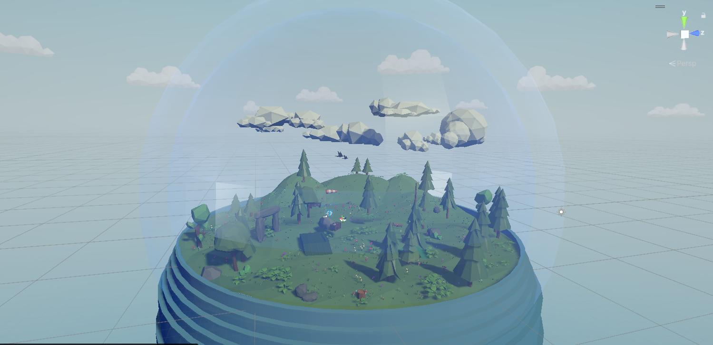
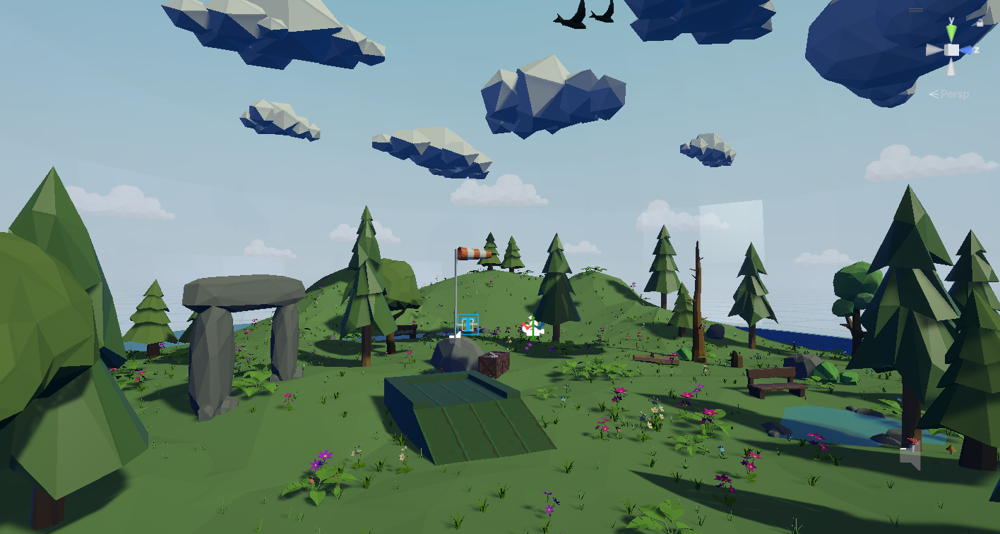
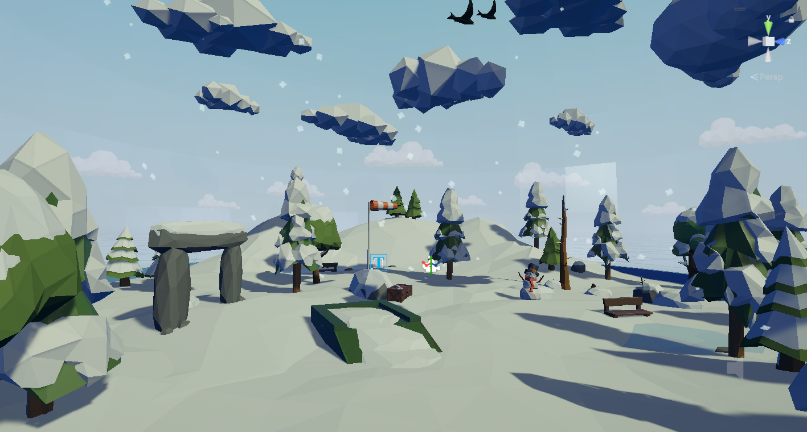
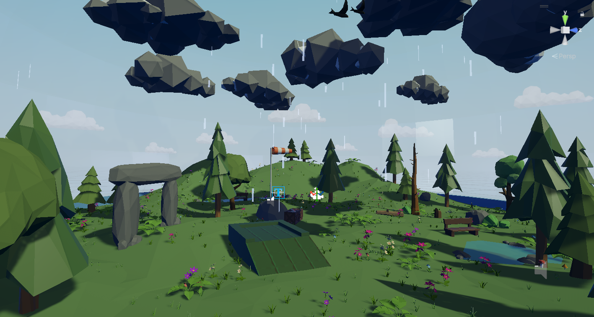
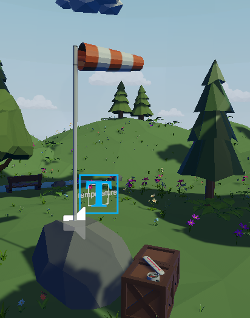

# Projet Fil Rouge - Météo VR 



## Description

Ce projet est une application de visualisation météo immersive en Réalité Virtuelle. L'utilisateur est plongé au cœur d'une **grande boule à neige** contenant un environnement **Low Poly** dynamique. L'originalité du projet réside dans sa capacité à traduire des données météorologiques réelles en changements visuels et atmosphériques concrets au sein de cet univers miniature.

## Fonctionnalités

* **Immersion VR** : Expérience conçue pour la réalité virtuelle (compatible avec les standards XR).
* **Météo en Temps Réel** : Synchronisation avec l'API Open-Meteo pour la récupération dynamique de la température, de la vitesse & direction du vent, des précipitations et du cycle jour/nuit.
* **Environnement Variable** : Le décor (ciel, éclairage, précipitations, couverture nuageuse) s'adapte automatiquement aux conditions météorologiques actuelles.
* **Système de Vent Procédural** : Animation physique de la manche à air et déviation des particules (pluie et neige) en fonction de l'intensité et de l'orientation réelles du vent.
* **Végétation Intelligente** : Génération procédurale de la flore (herbes, fleurs, fougères) s'adaptant au relief de la scène, incluant un système de masquage automatique sous la neige pour un rendu hivernal cohérent.
* **Ambiance Sonore Spatialisable** : Design sonore réactif intégrant le bruit du vent proportionnel à sa force, ainsi que des chants d'oiseaux conditionnés par l'ensoleillement et le cycle diurne.
* **Style Low Poly** : Une direction artistique épurée et performante, idéale pour garantir la fluidité requise en VR.
* **Concept de "Boule à Neige"** : Un monde miniature contenu limitant la zone de rendu tout en renforçant l'aspect contemplatif de l'application.

## Aperçu Visuel

**Contraste des saisons et adaptation de l'environnement :**

<p align="center">
  
  &nbsp; &nbsp; &nbsp;
  
  &nbsp; &nbsp; &nbsp;
  
</p>

**Station météo et interface (UI Diégétique) :**

<p align="center">
  
</p>

## Spécifications Techniques

* **Moteur** : Unity `6000.3.5f2`
* **Pipeline de rendu** : URP (Universal Render Pipeline)
* **Target SDK** : OpenXR / XR Interaction Toolkit
* **API Externe** : Open-Meteo API (JSON via `UnityWebRequest`)

## Installation & Utilisation

### Prérequis

* Unity Hub installé.
* Éditeur Unity version **6000.3.5f2** (ou supérieure dans la branche 6000).
* Un casque VR compatible (Oculus/Meta Quest, Valve Index, HP Reverb, etc.).

### Cloner le projet

```bash
git clone [https://github.com/Ectobiologist80/ProjetFilRouge-Meteo.git](https://github.com/Ectobiologist80/ProjetFilRouge-Meteo.git)
